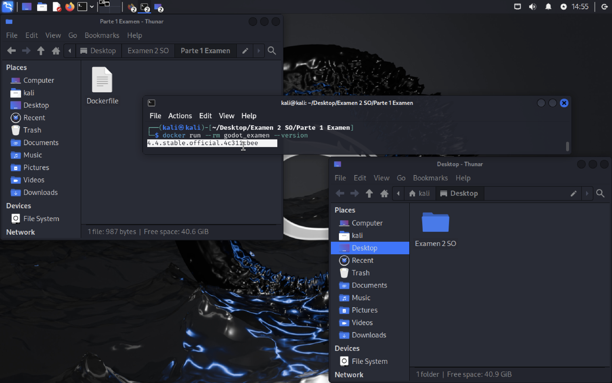
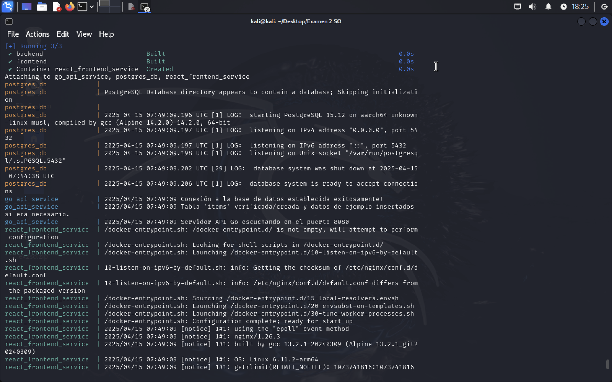
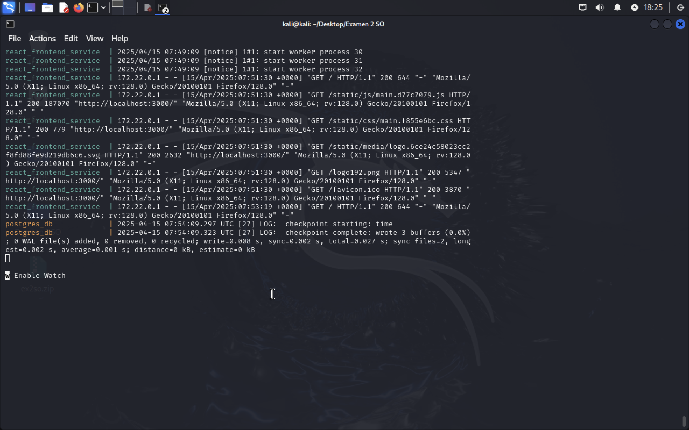

# Examen Segundo Parcial Sistemas Operativos
## Realizado por: Santiago Bañuelos Hernández

## Primera parte del examen 

### En mi caso, tuve problemas desde la primera parte del examen ya que aunque era bastante sencilla ya que sólo había que rellenar el Dockerfile, no tompe en cuenta (porque realmente ni lo sabia ni lo pensé) que la arquitectura era diferente, y por tanto, había que laterar muchas cosas del Dockerfile, pues la máquina virtual de Kali corriendo en un procesador M1 es de la arquitectura "aarch64".
### Tras haberlo investigado y estar a punto de dejar a la mitad esta parte del examen, noté que el archivo que originalmente se corría en el Dockerfile no lo podía leer mi computadora por ser de una arquitectura diferente.

### Aquí, dos de las páginas que visité para poder concluir esta parte del examen:
- [https://docs.docker.com/reference/dockerfile/#example-running-a-multi-line-script](https://docs.docker.com/reference/dockerfile/#example-running-a-multi-line-script)
- [https://docs.godotengine.org/en/stable/contributing/development/compiling/compiling_for_linuxbsd.html](https://docs.godotengine.org/en/stable/contributing/development/compiling/compiling_for_linuxbsd.html)

### Prueba de la primera parte del examen funcionando:

## Segunda parte del examen 

### Esta fue por mucho la parte difícil del examen 

### Prueba de la segunda parte del examen funcionando:

### Aquí podemos ver cómo es que se ejecuta el proyecto, lo único que hay que hacer es escribir en terminal en la carpeta principal del proyecto "docker compose up --build" y el proyecto se ejecutará solito para después acceder a localhost:3000 donde veremos cómo es que se levantó ya todo el proyecto.

## Cierre

### Definitivamente lo difícil de este examen fue todo el tema de programacion pero también temas relativamente más sencillos como instalar docker compose y dejar de usar docker-compose que se basa en Python (o algo así por lo que entendí) y tiende a fallar demasiado. En conclusión, considero que el examen fue difícil pero resume e integra los conocimientos del parcial de una forma interesante.
